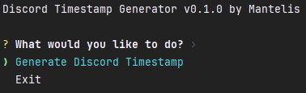
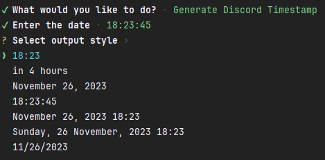
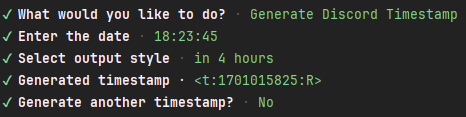
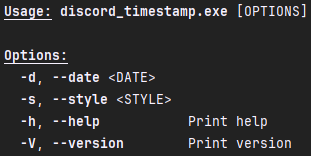

# Discord Timestamps Generator

## Description

This is a simple CLI tool to generate Discord timestamps. It supports two modes: interactive and argument-based.

## Supported input date formats

| Format                | Example               | Explanation                                               |
|-----------------------|-----------------------|-----------------------------------------------------------|
| `hh:mm:ss`            | `18:23:45`            | Timestamp at today's 18 hours, 23 minutes and 45 seconds. |
| `mm:ss`               | `23:45`               | Timestamp at today's 23 minutes and 45 seconds.           |
| `yyyy-mm-dd hh:mm:ss` | `2021-01-01 18:23:45` | Timestamp at 2021-01-01 18:23:45.                         |
| `yyyy-mm-dd hh:mm`    | `2021-01-01 18:23`    | Timestamp at 2021-01-01 18:23:00.                         |
| `+15s`                | `+15s`                | Timestamp at 15 seconds from now.                         |
| `+15m`                | `+15m`                | Timestamp at 15 minutes from now.                         |
| `+15h`                | `+15h`                | Timestamp at 15 hours from now.                           |
| `+15d`                | `+15d`                | Timestamp at 15 days from now.                            |
| `-15s`                | `-15s`                | Timestamp at 15 seconds ago.                              |
| `-15m`                | `-15m`                | Timestamp at 15 minutes ago.                              |
| `-15h`                | `-15h`                | Timestamp at 15 hours ago.                                |
| `-15d`                | `-15d`                | Timestamp at 15 days ago.                                 |

## Formatting

| Style           | Input              | Output (12-hour clock)               | Output (24-hour clock)            |
|-----------------|--------------------|--------------------------------------|-----------------------------------|
| Default         | `<t:1543392060>`   | November 28, 2018 9:01 AM            | 28 November 2018 09:01            |
| Short Time      | `<t:1543392060:t>` | 9:01 AM                              | 09:01                             |
| Long Time       | `<t:1543392060:T>` | 9:01:00 AM                           | 09:01:00                          |
| Short Date      | `<t:1543392060:d>` | 11/28/2018                           | 28/11/2018                        |
| Long Date       | `<t:1543392060:D>` | November 28, 2018                    | 28 November 2018                  |
| Short Date/Time | `<t:1543392060:f>` | November 28, 2018 9:01 AM            | 28 November 2018 09:01            |
| Long Date/Time  | `<t:1543392060:F>` | Wednesday, November 28, 2018 9:01 AM | Wednesday, 28 November 2018 09:01 |
| Relative Time   | `<t:1543392060:R>` | 3 years ago                          | 3 years ago                       |

## Installation

### From source

1. Clone the repository.
2. Run `cargo build --release`.
3. The binary will be located at `target/release/discord_timestamp.exe`.
4. Run the binary.

Additionally, you can install the binary using `cargo install --path .`. After that, you can run the binary
using `discord_timestamp` from anywhere.

### From binary

1. Download the binary from the [releases page]().
2. Run the binary.

Additionally, you can add the binary to your `PATH` environment variable.

## Screenshots

### Interactive mode

### Argument-based mode

Run command `discord_timestamp -h`.

